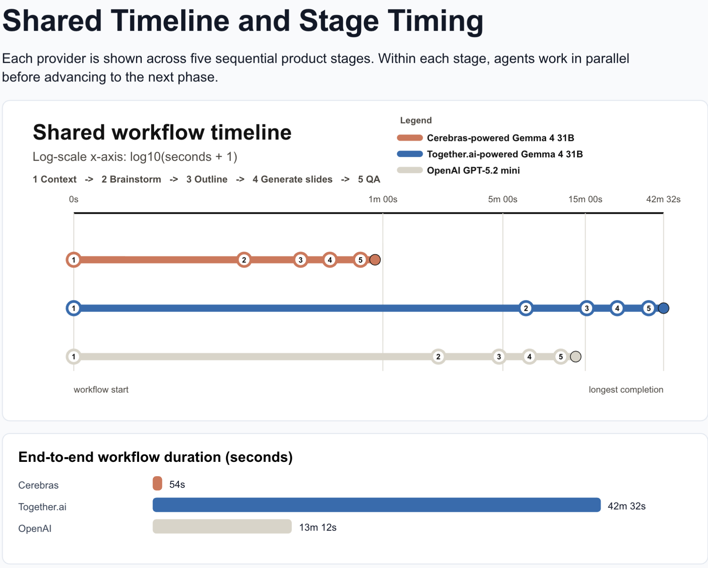
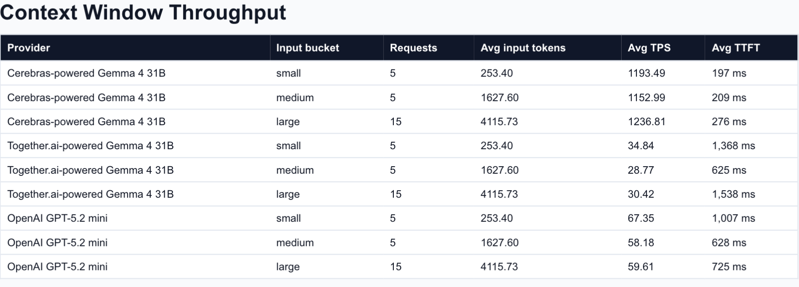
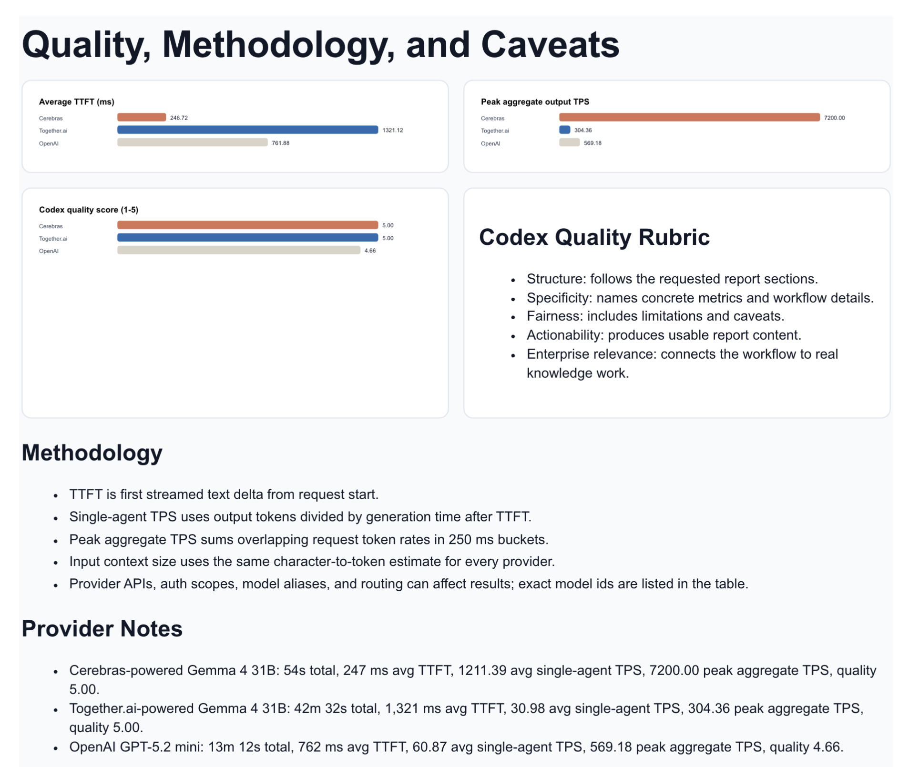

# Comparative Agent Workflow Benchmark

This benchmark measures the staged Gemma Deck Forge workflow rather than isolated single-prompt latency. Each provider runs the same five product stages: context, brainstorm, outline, Figma slide generation, and visual QA. Within each stage, agents work in parallel before the workflow advances.

The result to notice: Cerebras-powered Gemma 4 31B completed the full workflow in 54 seconds and reached the highest measured aggregate streamed output throughput in this run.

## Headline Results

| Setup | Model | End-to-end | Avg TTFT | Avg single-agent TPS | Peak aggregate TPS | Parallel agents | Quality score |
| --- | --- | ---: | ---: | ---: | ---: | ---: | ---: |
| Cerebras-powered Gemma 4 31B | `gemma-4-31b` | 54s | 247 ms | 1211.39 | 7200.00 | 10 | 5.00 |
| Together.ai-powered Gemma 4 31B | `google/gemma-4-31b-it` | 42m 32s | 1,321 ms | 30.98 | 304.36 | 10 | 5.00 |
| OpenAI GPT-5.2 mini | `gpt-5.2-mini` | 13m 12s | 762 ms | 60.87 | 569.18 | 10 | 4.66 |

## Shared Timeline

The timeline uses a log-scale x-axis so a 54-second run and a 42-minute run can be read on the same chart. The numbered checkpoints map to:

1. Context
2. Brainstorm
3. Outline
4. Generate slides
5. QA

## Context Window Throughput

The context-window view groups requests by estimated input size. The same character-to-token estimate is used for every provider so relative throughput comparisons are consistent across small, medium, and large prompts.

## Quality, Methodology, and Caveats

### Methodology

- Test date: June 29, 2026.
- Workflow: context retrieval, brainstorming, outline generation, Figma slide generation, and visual QA.
- Parallelism: each workflow stage fans out up to ten agent requests, then waits for that stage's required outputs before advancing.
- TTFT: first streamed text delta from request start.
- Single-agent TPS: generated output tokens divided by generation time after TTFT.
- Peak aggregate TPS: sum of overlapping streamed token rates in 250 ms buckets.
- Input buckets: small, medium, and large prompts using the same input-token estimate for each provider.
- Quality score: a Codex review rubric scored each provider's output on structure, specificity, fairness, actionability, and enterprise relevance.

### Provider Notes

- Cerebras-powered Gemma 4 31B: 54s total, 247 ms average TTFT, 1211.39 average single-agent TPS, 7200.00 peak aggregate TPS, quality 5.00.
- Together.ai-powered Gemma 4 31B: 42m 32s total, 1,321 ms average TTFT, 30.98 average single-agent TPS, 304.36 peak aggregate TPS, quality 5.00.
- OpenAI GPT-5.2 mini: 13m 12s total, 762 ms average TTFT, 60.87 average single-agent TPS, 569.18 peak aggregate TPS, quality 4.66.

### Caveats

This is a product-workflow benchmark, not a universal model leaderboard. It measures the latency and throughput profile that matters for a staged agentic application where many small agents need to collaborate in parallel. Provider routing, regional availability, model aliases, rate limits, streaming behavior, and client-side orchestration can affect results.

The benchmark also intentionally measures end-to-end product time. That includes staged waiting, agent fan-out, synthesis, and QA handoff overhead because those are the parts users experience in a real slide-prep workflow.

## Takeaway

Gemma Deck Forge depends on a UX pattern where many specialized agents write, review, diagnose, and repair at the same time. Cerebras throughput makes that pattern feel immediate: the system can run multiple context, design, narrative, and visual QA loops while still preserving an interactive user experience.
