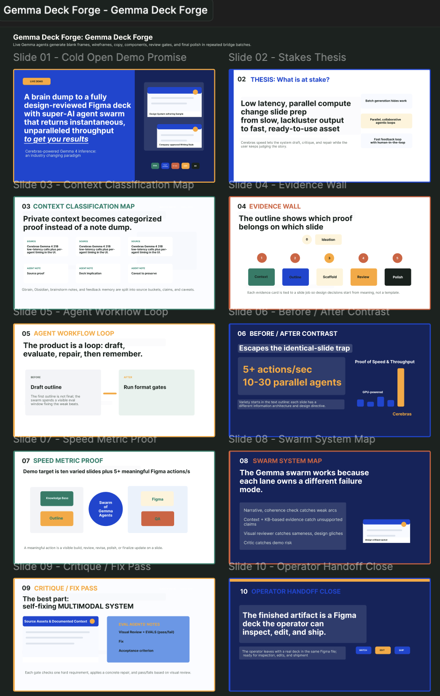
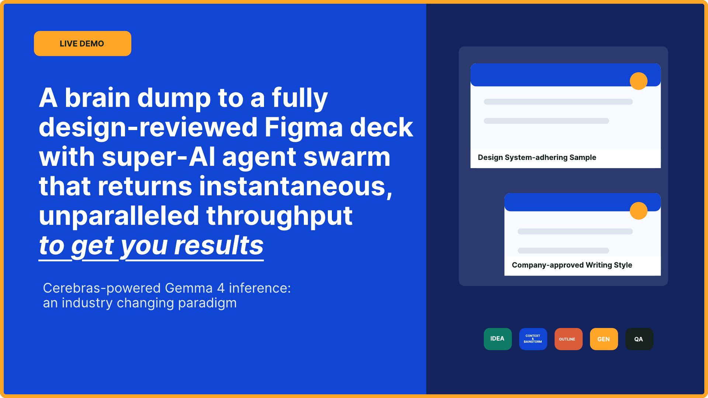
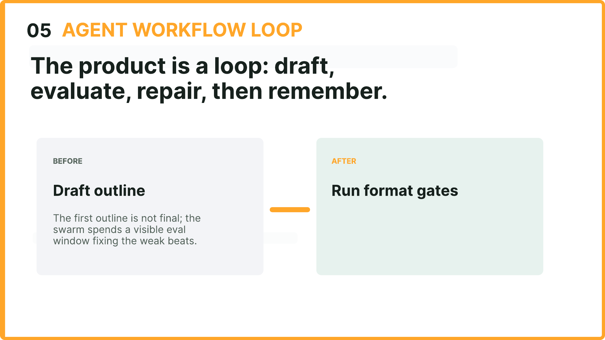
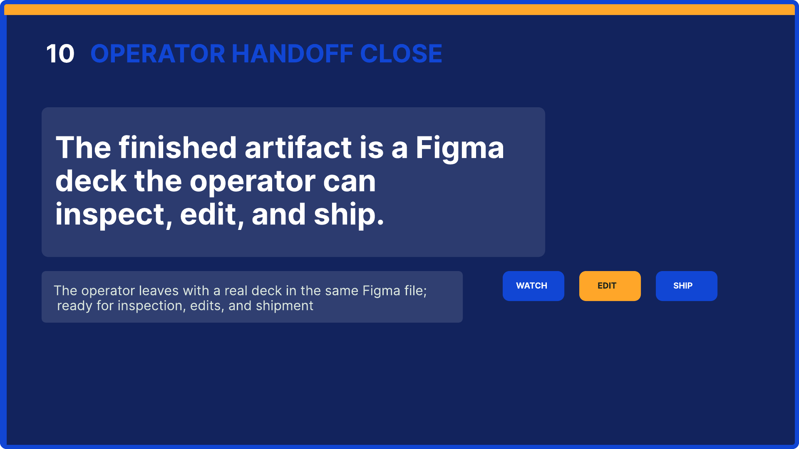
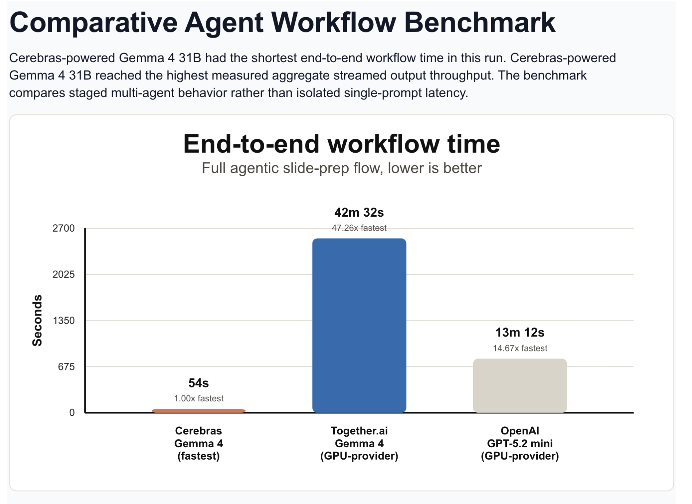
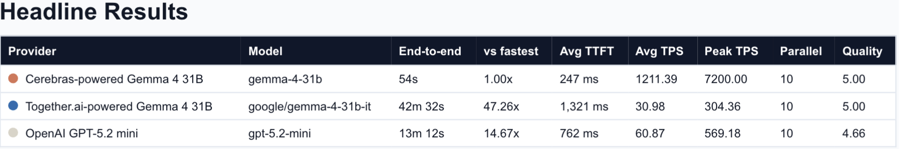
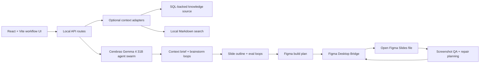

# Gemma Deck Forge

Gemma Deck Forge turns a rough idea into a polished, editable Figma deck with a swarm of Cerebras-powered Gemma 4 31B agents. The workflow is built around visible parallel work: context retrieval, brainstorm synthesis, slide outlining, Figma generation, screenshot-based review, and targeted repair loops.

[Watch the 60-second demo](https://www.loom.com/share/3bbedfe9f48c4511a5c635e63b444ff4) · [Open the demo slides PDF](demo_video_slides.pdf) · [Read the benchmark notes](BENCHMARKS.md)



## What It Does

Gemma Deck Forge starts with a simple braindump, then sends specialized agents through a staged workflow:

- retrieve and tighten relevant context;
- brainstorm multiple narrative angles;
- convert the strongest direction into a varied slide outline;
- generate native Figma Slides through a local desktop bridge;
- inspect slide screenshots for hierarchy, spacing, copy density, brand fit, and visual defects;
- produce concrete repair instructions and execute follow-up Figma edits.

The important product shift is that deck generation becomes an interactive multi-agent workspace instead of a one-shot prompt. Users can see agents working in parallel, inspect intermediate artifacts, and send manual feedback back into the same QA loop.

## Why Cerebras Matters

Most agentic creative tools are bottlenecked by sequential model calls. Gemma Deck Forge is designed for a different inference shape: 10-30 small, specialized Gemma 4 31B agents can collaborate at once because Cerebras keeps latency and throughput low enough for the work to feel live.

That changes the UX. A slide deck can be drafted, critiqued, repaired, and re-reviewed while the user is still in flow. The system does not depend on one huge prompt getting everything right; it uses many fast loops to improve the story, content, layout, and polish.

## Enterprise Fit

Slides are still a high-friction enterprise artifact: interns, PMs, executives, engineers, sales teams, and customer teams all need clear decks on short notice, but the work is context-heavy, brand-sensitive, and easy to get wrong. Gemma Deck Forge treats that as an enterprise knowledge workflow rather than a template problem.

The app keeps private context adapters optional, turns retrieved source material into inspectable intermediate artifacts, and writes to an editable Figma deck instead of a locked export. That makes the workflow practical for real teams: fast enough for live iteration, structured enough for review, and flexible enough to preserve a team's visual system and narrative standards.

## Multimodal Design Loop

Gemma is used for more than writing copy. The system can study reference decks, example screenshots, and generated slide images to infer layout patterns, visual hierarchy, color usage, component grammar, and narrative structure. After generation, per-slide reviewer agents look at the actual rendered result, return pass/fail structured feedback, and translate issues into surgical Figma bridge actions.

This makes the deck editable and inspectable at every step: the output is a real Figma artifact, not a flattened image or a locked presentation export.

## Demo

- Demo video: [Loom walkthrough](https://www.loom.com/share/3bbedfe9f48c4511a5c635e63b444ff4)
- Demo deck PDF: [demo_video_slides.pdf](demo_video_slides.pdf)
- Rendered slide examples from the demo deck:

| Opening | Workflow | Final Handoff |
| --- | --- | --- |
|  |  |  |

## Benchmark Snapshot

The benchmark compares the full staged agent workflow, not a single isolated prompt. In this run, Cerebras-powered Gemma 4 31B completed the end-to-end slide-prep workflow in 54 seconds while preserving ten parallel agent lanes.





See [BENCHMARKS.md](BENCHMARKS.md) for methodology, TTFT, throughput, shared timeline, context-window results, and caveats.

## Architecture



Core code paths:

- `src/App.tsx`: staged UI, server-sent events, Figma action logs, and feedback UI.
- `src/server/apiPlugin.ts`: local API routes for context, brainstorming, outline generation, Figma build, QA, and feedback.
- `src/server/cerebras.ts`: Cerebras chat-completions client with key fallback and error redaction.
- `src/server/contextSwarm.ts`: parallel context workflows and optional local retrieval adapters.
- `src/server/deck.ts`: brainstorming, outline generation, eval/fix loops, and deterministic fallback content.
- `src/server/figmaBridge.ts`: WebSocket transport to the local Figma Desktop Bridge plugin.
- `src/shared/figma.ts`: Figma build-plan and QA execution script generation.

## Requirements

- Node.js 20 or newer
- npm
- A Cerebras API key with Gemma 4 31B access
- Figma Desktop
- Figma Desktop Bridge plugin installed in Figma Desktop
- Optional: Supabase CLI for a SQL context adapter
- Optional: `ripgrep` (`rg`) for fast local Markdown search

## Quick Start

```bash
git clone https://github.com/ch920425/gemma-deck-forge.git
cd gemma-deck-forge
npm install
cp .env.example .env
npm run setup:check
```

Edit `.env` and add your provider credentials:

```bash
CEREBRAS_API_KEY=your_cerebras_key_here
CEREBRAS_MODEL=gemma-4-31b
```

Run the app:

```bash
npm run dev -- --port 5174
```

Open the printed local URL, usually:

```text
http://127.0.0.1:5174/
```

## Figma Desktop Bridge

1. Open Figma Desktop.
2. Open or create a Figma Slides file.
3. Run the Figma Desktop Bridge plugin from `Plugins -> Development`.
4. Confirm the plugin shows `READY`.
5. In the web app, complete context, brainstorming, and outline stages.
6. Click `Generate Figma Deck`.
7. Click `Run Figma QA Loop` to inspect screenshots and apply repair passes to the generated slides.

The bridge defaults to port `9223`. If you change it, set the matching environment variable before starting the app:

```bash
GEMMA_FIGMA_BRIDGE_PORT=9223 npm run dev -- --port 5174
```

## Supporting CLI

```bash
npm run install:guide
npm run setup:check
npm run security:scan
```

The CLI prints setup guidance, validates local prerequisites, and scans committed files for public-release risks without printing secret values.

## Optional Context Setup

Gemma Deck Forge works without private context sources by using built-in fallback context. To connect your own sources, configure optional adapters in `.env`:

```bash
KNOWLEDGE_SUPABASE_WORKDIR=/path/to/your/supabase/project
KNOWLEDGE_SUPABASE_DB_URL=postgresql://...
LOCAL_NOTES_PATH=/path/to/markdown/notes
```

Do not commit `.env`. It is ignored by git.

## Verification

Recommended checks before publishing changes:

```bash
npm run lint
npm test
npm run test:coverage
npm run build
npm run security:scan
```

Optional browser test:

```bash
npm run test:e2e
```

Optional live provider test:

```bash
npm run test:live
```

## Security Notes

- Real credentials belong only in `.env` or your local shell environment.
- `.env`, local runtime data, generated coverage, and build output are not committed.
- Context adapters are opt-in; no personal knowledge-base path or account identifier is hardcoded.
- Provider errors are redacted before they reach the UI or logs.
- The Figma bridge runs locally and mutates only the open Figma file where the plugin is active.
- Before making release changes public, run the project scanner and a private-path scan against the committed tree.

## Project Guidance

- [Agent guide](AGENTS.md)
- [Install skill](skills/install/SKILL.md)
- [Public release skill](skills/public-release/SKILL.md)
- [Product requirements](docs/product-requirements.md)
- [Technical architecture](docs/technical-architecture.md)
