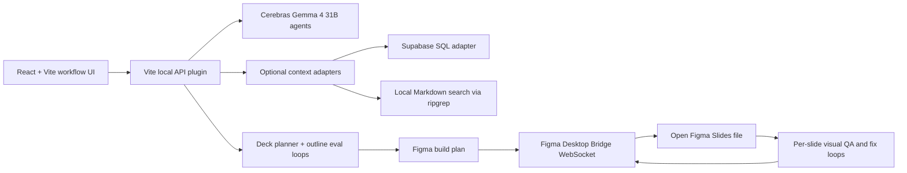

# Gemma Deck Forge

Gemma Deck Forge turns a rough idea into a polished Figma Slides deck with a visible swarm of Gemma 4 31B agents running on Cerebras. The product emphasizes what high-throughput inference changes: instead of waiting for one slow model call, users can see context writers, brainstormers, slide planners, Figma builders, and visual QA agents working in parallel.

## Why It Matters

Most slide tools hide the hard work behind a spinner. Gemma Deck Forge makes the work inspectable: agents retrieve context, write a concise brief, brainstorm multiple angles, draft a varied slide outline, generate the deck in Figma, and run visual QA loops that diagnose and fix layout issues. Cerebras speed makes those loops interactive enough for a creative workflow instead of a background batch job.

For enterprise teams, this is a pattern for high-speed knowledge work: private context can stay local or inside the user's own data systems, while agent swarms transform it into presentation-ready artifacts with reviewable intermediate traces.

## Features

- Step-by-step workflow: braindump, context gathering, brainstorming, outline generation, Figma generation, QA polish, and manual feedback.
- Parallel context lanes with optional adapters for a Supabase-backed knowledge table and a local Markdown notes folder.
- Five brainstorming agents with different angles, plus eval/fix loops that tighten the final brief before slide planning.
- Ten distinct slide-outline formats so the deck does not look like one repeated template.
- Figma Desktop Bridge integration for live slide creation and follow-up QA edits.
- Per-slide QA loop designed around export, visual diagnosis, structured fix instructions, bridge execution, and repeat-until-pass behavior.
- Local feedback memory so later runs can preserve the user's preferences without sending extra configuration to the repo.

## Project Guidance

- [Agent guide](AGENTS.md)
- [Install skill](skills/install/SKILL.md)
- [Public release skill](skills/public-release/SKILL.md)
- [Product requirements](docs/product-requirements.md)
- [Technical architecture](docs/technical-architecture.md)

## Architecture



Core code paths:

- `src/App.tsx`: staged UI, SSE event handling, Figma action logs, feedback UI.
- `src/server/apiPlugin.ts`: local API routes for context, generation, feedback, Figma build, and Figma QA.
- `src/server/cerebras.ts`: Cerebras chat-completions client with key fallback and error redaction.
- `src/server/contextSwarm.ts`: parallel context workflows and optional local retrieval adapters.
- `src/server/deck.ts`: brainstorming, outline generation, eval/fix loops, and deterministic fallback content.
- `src/server/figmaBridge.ts`: local WebSocket bridge transport to the Figma Desktop plugin.
- `src/shared/figma.ts`: Figma build-plan and QA execution script generation.

## Requirements

- Node.js 20 or newer
- npm
- A Cerebras API key with Gemma 4 31B access
- Figma Desktop for live deck generation
- The Figma Desktop Bridge plugin installed in Figma Desktop for live mutations
- Optional: Supabase CLI for the SQL context adapter
- Optional: `ripgrep` (`rg`) for fast local Markdown search

## Quick Start

```bash
git clone https://github.com/ch920425/gemma-deck-forge.git
cd gemma-deck-forge
npm install
cp .env.example .env
npm run setup:check
```

Edit `.env` and add at least:

```bash
CEREBRAS_API_KEY=your_cerebras_key_here
CEREBRAS_MODEL=gemma-4-31b
```

Run the app:

```bash
npm run dev -- --port 5174
```

Open the printed local URL, usually:

```text
http://127.0.0.1:5174/
```

## Supporting CLI

```bash
npm run install:guide
npm run setup:check
npm run security:scan
```

The CLI prints setup guidance, validates local prerequisites, and scans committed files for public-release risks without printing secret values.

## Optional Context Setup

Gemma Deck Forge runs without private context adapters by using built-in fallback context. To connect your own sources, configure these optional environment variables in `.env`:

```bash
KNOWLEDGE_SUPABASE_WORKDIR=/path/to/your/supabase/project
KNOWLEDGE_SUPABASE_DB_URL=postgresql://...
LOCAL_NOTES_PATH=/path/to/markdown/notes
```

Do not commit `.env`. The file is ignored by git.

## Figma Desktop Bridge Setup

1. Open Figma Desktop.
2. Open or create a Figma Slides file.
3. Run the Figma Desktop Bridge plugin from `Plugins -> Development`.
4. Confirm the plugin shows `READY`.
5. In the web app, move through the workflow and click `Generate Figma Deck`.
6. After generation completes, click `Run Figma QA Loop` to polish the generated slides.

The bridge defaults to port `9223`. If you change it, set the matching environment variable before starting the app:

```bash
GEMMA_FIGMA_BRIDGE_PORT=9223 npm run dev -- --port 5174
```

## Verification

Recommended checks before submitting or deploying:

```bash
npm run lint
npm test
npm run test:coverage
npm run build
npm run security:scan
```

Optional browser test:

```bash
npm run test:e2e
```

Optional live provider test:

```bash
npm run test:live
```

## Security Notes

- Real credentials belong only in `.env` or your local shell environment.
- `.env`, local runtime data, generated coverage, and build output are not committed.
- Context adapters are opt-in; no personal knowledge-base path or account identifier is hardcoded.
- Provider errors are redacted before they reach the UI or logs.
- The Figma bridge runs locally and mutates only the open Figma file where the plugin is active.
- Before making the repository public, run a credential scanner and a private-path scan against the committed tree. Keep local `.env` files and generated outputs out of git.

## Core Workflow

1. Braindump a rough idea.
2. Retrieve and tighten context with parallel agents.
3. Brainstorm the deck structure through multiple agentic loops.
4. Generate a varied ten-slide outline.
5. Build the Figma deck live.
6. Run the visual QA loop and submit manual feedback for another polish pass.

The core product takeaway: Cerebras makes many small agent decisions fast enough to become part of the user experience, while the Figma bridge and QA loops keep the final artifact inspectable.
