# Dynamic Agentic Slide Demo Technical Spec

## Objective

Implement a dynamic, self-improving Gemma swarm workflow for Gemma Deck Forge:

`idea + gbrain context -> timed outline drafting/eval loop -> varied slide plan -> timed Figma build/eval/fix/polish loop -> screenshot-verified 10-slide deck`

The implementation must make parallel reasoning visible while keeping Figma writes deterministic and safe.

## Architecture Overview

```mermaid
flowchart LR
  A["User message + gbrain context"] --> B["Source + intent normalizer"]
  B --> C["Parallel Gemma agent swarm"]
  C --> D["Outline mutation ledger"]
  D --> E["Outline evaluator loop"]
  E --> F["Varied scaffold planner"]
  F --> G["Figma mutation scheduler"]
  G --> H["Single Figma writer queue"]
  H --> I["Screenshot + metric verifier"]
  I --> J["Feedback memory"]
  E --> D
  I --> F
```



Key rule:

- Parallelize model thinking.
- Serialize Figma writes.

The Figma bridge should not receive competing concurrent mutations. The product should show fast parallel agent work, then apply a scheduled stream of ordered Figma operations at `>= 5 actions/sec`.

## New Domain Model

### `DynamicDemoPlan`

```ts
interface DynamicDemoPlan {
  id: string;
  title: string;
  sourceDigest: SourceDigest;
  documentationPhase: DocumentationPhasePlan;
  figmaPhase: FigmaPhasePlan;
  successCriteria: DemoSuccessCriteria;
}
```

### `DocumentationPhasePlan`

```ts
interface DocumentationPhasePlan {
  minDurationMs: 6000;
  agentLanes: AgentLane[];
  initialOutline: OutlineDraft;
  mutationLedger: OutlineMutation[];
  evals: OutlineEval[];
  finalOutline: OutlineDraft;
}
```

### `OutlineMutation`

```ts
type OutlineMutationType =
  | "create_slide"
  | "delete_slide"
  | "split_slide"
  | "merge_slides"
  | "reorder_slide"
  | "retitle_slide"
  | "change_slide_type"
  | "attach_evidence"
  | "tighten_copy"
  | "add_speaker_beat";

interface OutlineMutation {
  id: string;
  atMs: number;
  agentId: AgentId;
  type: OutlineMutationType;
  targetSlideIds: string[];
  rationale: string;
  before?: unknown;
  after?: unknown;
  visibleMessage: string;
}
```

### `SlideScaffold`

```ts
type SlideScaffoldFamily =
  | "speak-map-opener"
  | "learning-journey-map"
  | "platform-system-map"
  | "before-after-workflow"
  | "agent-swarm-board"
  | "eval-diagnostic-report"
  | "proof-artifact"
  | "metric-scoreboard"
  | "split-merge-timeline"
  | "cohesion-polish"
  | "closing-question"
  | "speak-agenda"
  | "oversized-quote"
  | "platform-health-scoreboard"
  | "agent-docs-loop"
  | "shared-ui-pill-cluster"
  | "phone-confidence-demo"
  | "signal-quality-chart"
  | "shoutout-grid"
  | "dark-section-divider";

interface SlideScaffold {
  family: SlideScaffoldFamily;
  density: "sparse" | "balanced" | "dense";
  background: "dark" | "light" | "canvas";
  primaryPrimitive: "blue-lane" | "orange-tile" | "artifact" | "metric" | "timeline";
  requiredBlocks: string[];
  disallowedAdjacentFamilies: SlideScaffoldFamily[];
}
```

### `FigmaPhasePlan`

```ts
interface FigmaPhasePlan {
  minDurationMs: 10000;
  targetFinalSlideCount: 10;
  referenceStyle: ReferenceStyleExtraction;
  scheduledMutations: FigmaMutation[];
  finalVerification: FigmaVerificationPlan;
}
```

### `FigmaMutation`

```ts
type FigmaMutationPhase =
  | "bare_create"
  | "scaffold"
  | "draft_text"
  | "per_slide_eval"
  | "fix"
  | "split_merge_delete"
  | "holistic_eval"
  | "cohesion"
  | "polish"
  | "final_gate";

interface FigmaMutation {
  id: string;
  atMs: number;
  phase: FigmaMutationPhase;
  slideId?: string;
  action: string;
  figmaOp: "create" | "update" | "delete" | "move" | "style" | "annotate" | "verify";
  visibleMessage: string;
  payload: Record<string, unknown>;
}
```

## Reference Style Extraction

### Extraction Inputs

Use this order:

1. `figma_get_status({ probe: true })`
2. `figma_navigate(referenceUrl)`
3. `figma_search_components({ query: "", limit: 25 })`
4. `figma_get_design_system_summary()`
5. `figma_list_slides()` when the file is a Slides file
6. `figma_get_slide_grid()` and `figma_get_slide_content()` when available
7. `figma_execute()` read-only page inventory for design files
8. `figma_capture_screenshot()` or CuaDriver screenshot for visual inspection

### Observed Reference Extraction

Current observed extraction from the reference file:

```ts
const observedReferenceStyle = {
  fileName: "Agentic Figma Slides Outlining + Design Finalization",
  localComponents: 0,
  componentSets: 0,
  tokens: 0,
  topLevelReferenceFrames: 41,
  nodeCounts: {
    frame: 51,
    text: 438,
    rectangle: 283,
    ellipse: 47,
    vector: 22,
    table: 1
  },
  primitives: [
    { role: "major-lane", text: "Learning Journey", fill: "#0D99FF", size: [301, 672] },
    { role: "major-lane", text: "Content Gen Platform", fill: "#0D99FF", size: [301, 198] },
    { role: "major-lane", text: "Outcomes", fill: "#0D99FF", size: [301, 198] },
    { role: "tool-tile", text: "MFY (Onboarding Interests)", fill: "#FFA629", size: [301, 88] },
    { role: "tool-tile", text: "Speak Tutor Lessons", fill: "#FFA629", size: [301, 88] },
    { role: "tool-tile", text: "Takeaway Lessons", fill: "#FFA629", size: [301, 88] },
    { role: "tool-tile", text: "PLL (and its variations)", fill: "#FFA629", size: [301, 88] },
    { role: "tool-tile", text: "DOUG", fill: "#FFA629", size: [301, 88] },
    { role: "tool-tile", text: "KEITH", fill: "#FFA629", size: [301, 88] },
    { role: "tool-tile", text: "KEITH Lite", fill: "#FFA629", size: [301, 88] }
  ],
  referenceFramePatterns: [
    "agenda",
    "sparse-thesis",
    "oversized-customer-quote",
    "metric-comparison",
    "numbered-bet-foundation",
    "dense-org-update",
    "timeline-table",
    "dark-section-divider",
    "platform-health-stat-cards",
    "current-state-scorecard",
    "agent-docs-loop-diagram",
    "release-ci-content-cards",
    "phone-confidence-demo",
    "signal-quality-chart",
    "binary-size-before-after",
    "q3-focus-card-row",
    "people-shoutout-grid",
    "shared-ui-pill-cluster",
    "migration-metrics",
    "testing-ci-guardrails"
  ]
};
```

Implementation should generalize these into design tokens:

- `speakNavy = "#12235D"`
- `speakQuoteNavy = "#123C7A"`
- `speakBlue = "#2E5CF2"`
- `speakElectricBlue = "#1C49FF"`
- `speakGreen = "#05946B"`
- `speakCoral = "#FF6B57"`
- `speakYellow = "#FFC247"`
- `speakCard = "#F0F6FF"`
- `speakSoftCircle = "#E0E5FF"`
- `mapBlue = "#0D99FF"`
- `mapOrange = "#FFA629"`
- `canvasDark = "#1E1E1E"` from visible Figma canvas
- `slideInk = "#171717"`
- `slidePaper = "#FFFDF7"`

### Reference Scaffold Adapter

Because the reference material is frame-backed rather than component-backed, implement a `ReferenceScaffoldAdapter`:

```ts
interface ReferenceFramePattern {
  id: string;
  name: string;
  family: SlideScaffoldFamily;
  colors: string[];
  shapeNames: Record<string, number>;
  textPreview: string[];
  reusablePrimitives: ReusablePrimitive[];
}

interface ReusablePrimitive {
  name: string;
  kind: "left-rail" | "title-rule" | "soft-circle" | "stat-card" | "content-card" | "accent-rail" | "loop-card" | "pill" | "person-card" | "table" | "chart" | "device";
  fill?: string;
  width: number;
  height: number;
}
```

Extraction rules:

- Treat top-level `1920x1080` frames as slide references.
- Classify frame family from text preview and shape names.
- Extract recurring primitive names:
  - `left rail`
  - `title rule`
  - `soft circle`
  - `stat card`
  - `coverage card`
  - `content card`
  - `card accent`
  - `loop card`
  - `pill`
  - `person card`
  - `shoutout card`
  - `phone`
  - `bar`
  - `Table`
- Use primitive dimensions and relative positions as layout hints, not as exact clones.

Representative reference frames verified by screenshot:

- `49:539` Platform Health: three stat cards, left rail, title rule, soft circle, January-to-May bottom band.
- `49:616` Agent Docs: sparse large headline plus four loop cards.
- `49:791` Shared UI adoption: two content cards plus pill cluster.
- `49:920` Shoutouts: six person cards in a balanced grid.

## Agent Swarm

### Agent Lanes

Use parallel Gemma calls for bounded specialist outputs.

1. `source_archivist`
   - Extracts source facts, gbrain snippets, uncertainties, and proof candidates.
2. `story_architect`
   - Creates the narrative spine and first outline.
3. `slide_type_director`
   - Assigns scaffold families and forces visual variety.
4. `speak_design_mapper`
   - Maps outline beats to blue lane, orange tile, platform, journey, and outcome primitives.
5. `copy_surgeon`
   - Tightens titles, headlines, and speaker beats.
6. `per_slide_critic`
   - Scores every slide for job clarity, evidence, density, and visual fit.
7. `holistic_critic`
   - Scores story progression, rhythm, cohesion, and redundancy.
8. `figma_choreographer`
   - Converts the accepted plan into timed Figma mutations.

### Parallel Execution Contract

```ts
const agentResults = await Promise.allSettled([
  runGemmaAgent("source_archivist", input),
  runGemmaAgent("story_architect", input),
  runGemmaAgent("slide_type_director", input),
  runGemmaAgent("speak_design_mapper", input),
  runGemmaAgent("copy_surgeon", input),
  runGemmaAgent("per_slide_critic", input),
  runGemmaAgent("holistic_critic", input)
]);
```

The synthesizer then merges results into one `DocumentationPhasePlan`.

## Timing Scheduler

### Documentation Stage

Guarantee minimum duration without pretending the model is slow.

Implementation:

```ts
function scheduleDocumentationEvents(plan: DocumentationPhasePlan): StageEvent[] {
  return spreadEventsAcrossMinimumDuration({
    minDurationMs: 6000,
    tickMs: 120,
    events: [
      ...sourceEvents,
      ...draftEvents,
      ...mutationEvents,
      ...evalEvents,
      ...finalOutlineEvents
    ]
  });
}
```

Rules:

- The content can be generated quickly.
- The UI reveals it over at least 6 seconds.
- Event order must tell a coherent story.
- Events must include real structural mutations, not only "thinking" statuses.

### Figma Stage

Guarantee minimum duration and high visible throughput.

```ts
function scheduleFigmaMutations(plan: FigmaPhasePlan): FigmaMutation[] {
  return spreadEventsAcrossMinimumDuration({
    minDurationMs: 10000,
    tickMs: 80,
    minActionsPerSecond: 5,
    events: plan.scheduledMutations
  });
}
```

Hard checks:

- `mutationCount / (elapsedMs / 1000) >= 5`
- `elapsedMs >= 10000`
- `finalSlideCount === 10`

## Figma Writer Queue

Figma writes must run through a single queue:

```ts
class FigmaWriterQueue {
  private queue: FigmaMutation[] = [];
  private running = false;

  enqueueMany(mutations: FigmaMutation[]) {
    this.queue.push(...mutations);
  }

  async run(writer: FigmaMutationWriter) {
    if (this.running) return;
    this.running = true;
    while (this.queue.length) {
      const next = this.queue.shift()!;
      await writer.apply(next);
      await sleep(nextDelay(next));
    }
    this.running = false;
  }
}
```

The UI can show many Gemma lanes working in parallel, but only this queue touches Figma.

## Figma Build Choreography

### Phase 1: Bare Creation

- Create named section.
- Add rough blank frames.
- Add temporary slide labels only.
- Show no polished styling yet.

### Phase 2: Scaffold

- Apply different scaffold families to each frame.
- Use blue journey/platform/outcome blocks and orange tool tiles.
- Vary density and background.

### Phase 3: Draft Text

- Add rough titles and draft headlines.
- Add proof placeholders.
- Add speaker beat labels.

### Phase 4: Per-Slide Eval

- Add small eval badges or diagnostic sidebars.
- Mark issues like:
  - `too dense`
  - `weak proof`
  - `same layout as previous`
  - `headline is generic`
  - `needs artifact`

### Phase 5: Targeted Fix

- Modify the actual slide based on the visible diagnosis.
- Examples:
  - Convert a card grid into before/after workflow.
  - Replace generic text with gbrain evidence.
  - Split one overloaded slide into two, then delete a weaker filler slide to return to 10.

### Phase 6: Holistic Eval

- Add a deck-level cohesion board.
- Reorder slides if the story rhythm is weak.
- Merge redundant slides.
- Change slide type when the deck has too many of one scaffold.

### Phase 7: Polish

- Remove or shrink diagnostic overlays.
- Tighten alignment, contrast, spacing, line breaks, and visual rhythm.
- Show final action metrics.

## Prompt Contracts

### Outline Swarm Prompt

System:

```text
You are one specialist in a parallel Gemma deck-building swarm. Produce structured JSON only. Optimize for a live demo where the viewer must see thoughtful self-improvement, not one-shot generation.
```

User payload:

```json
{
  "idea": "...",
  "audience": "...",
  "gbrainContext": "...",
  "feedbackMemory": "...",
  "referenceStyle": {
    "majorLaneColor": "#0D99FF",
    "toolTileColor": "#FFA629",
    "primitives": ["Learning Journey", "Content Gen Platform", "Outcomes", "DOUG", "KEITH"]
  },
  "constraints": {
    "documentationMinMs": 6000,
    "figmaMinMs": 10000,
    "finalSlideCount": 10,
    "minScaffoldFamilies": 8
  }
}
```

Output:

```json
{
  "agentId": "story_architect",
  "findings": ["..."],
  "proposedSlides": [
    {
      "tempId": "draft-1",
      "job": "Set up the demo stakes",
      "headline": "Cerebras speed changes deck creation from batch to live collaboration",
      "proof": "measured stage/action timing",
      "preferredScaffold": "speak-map-opener"
    }
  ],
  "recommendedMutations": [
    {
      "type": "split_slide",
      "rationale": "The proof and workflow beats compete on one slide.",
      "visibleMessage": "Splitting the overloaded proof/workflow slide."
    }
  ],
  "risks": ["..."]
}
```

### Eval Prompt

System:

```text
You are a strict deck evaluator. Find redundancy, generic claims, weak proof, layout sameness, missing story logic, and visual rhythm problems. You must recommend concrete mutations.
```

Output:

```json
{
  "perSlide": [
    {
      "slideId": "s4",
      "score": 0.62,
      "diagnostics": ["same scaffold as s3", "proof is generic"],
      "requiredFixes": [
        {
          "type": "change_slide_type",
          "to": "proof-artifact",
          "reason": "This claim needs evidence, not another card grid."
        }
      ]
    }
  ],
  "holistic": {
    "score": 0.71,
    "diagnostics": ["middle section repeats agent-speed claim"],
    "requiredFixes": [
      {
        "type": "merge_slides",
        "slideIds": ["s6", "s7"],
        "reason": "Both explain review loops; combine and free one slot for outcome metrics."
      }
    ]
  }
}
```

### Figma Choreographer Prompt

System:

```text
Convert the accepted outline and eval decisions into a timed Figma mutation plan. Make visible improvement over time. Start bare, then scaffold, text, eval, fix, holistic cohesion, and final polish. Do not use the same layout on every slide.
```

Output:

```json
{
  "mutations": [
    {
      "atMs": 0,
      "phase": "bare_create",
      "slideId": "s1",
      "action": "create_blank_frame",
      "visibleMessage": "Creating rough slide frame 1."
    },
    {
      "atMs": 1840,
      "phase": "per_slide_eval",
      "slideId": "s3",
      "action": "add_eval_badge",
      "visibleMessage": "Critic: Slide 3 is overloaded; splitting workflow and proof."
    }
  ]
}
```

## UI Requirements

Add a new demo mode:

- `Dynamic Swarm Demo`

UI panels:

- Source digest
- Agent lanes
- Outline mutation ledger
- Per-slide eval board
- Holistic eval board
- Slide scaffold assignment grid
- Figma mutation timeline
- Runtime metrics

Metrics shown live:

- documentation elapsed time
- Figma elapsed time
- actions/sec
- slide count
- scaffold diversity count
- eval issues found
- eval fixes applied

## API Requirements

Add endpoints:

- `POST /api/dynamic-demo/plan`
  - returns `DynamicDemoPlan`
- `POST /api/dynamic-demo/stream`
  - SSE stream for documentation-stage and planning events
- `POST /api/figma/dynamic-build-plan`
  - returns executable Figma script and mutation timeline

The existing `/api/figma/build-plan` can remain as the fast v1 path.

## Verification Strategy

### Unit and Integration Tests

Add tests for:

- min-duration scheduler produces `>= 6000ms` documentation timeline
- min-duration scheduler produces `>= 10000ms` Figma timeline
- Figma mutations satisfy `>= 5 actions/sec`
- final plan normalizes to exactly 10 slides
- scaffold diversity count is `>= 8`
- adjacent scaffold repetition constraint
- mutation ledger includes split, merge, delete, reorder, and type change
- eval loop emits per-slide and holistic diagnostics
- Figma writer queue preserves operation order
- reference extractor handles:
  - real components
  - zero components with primitive extraction
  - design file instead of Slides file
  - disconnected bridge

### Browser E2E Tests

Add Playwright coverage for:

- dynamic demo button starts documentation-stage timeline
- documentation stage does not finish before 6 seconds
- outline ledger visibly includes structural mutations
- Figma build plan has at least 10 seconds of scheduled mutations
- UI shows at least 8 scaffold families
- generated script includes action-rate metrics and final screenshot instructions

### Live Figma QA

Manual/bridge validation:

- run generated script with Desktop Bridge
- capture section screenshot
- verify final slide count is 10
- verify no major text overlap or clipping
- verify visual variety is obvious in grid view
- verify measured result reports:
  - `documentationElapsedMs >= 6000`
  - `figmaElapsedMs >= 10000`
  - `actionsPerSecond >= 5`

## Implementation Plan

### Phase 1: Schemas and Scheduler

- Add dynamic demo schema types.
- Add min-duration event scheduler.
- Add diversity/eval success criteria validator.
- Add tests for timing, action rate, and scaffold diversity.

### Phase 2: Prompt and Agent Outputs

- Add structured prompts for agent lanes.
- Add synthesis logic that produces outline mutations.
- Add deterministic fallback plan with varied scaffolds.
- Add tests for fallback quality and mutation coverage.

### Phase 3: UI Timeline

- Add Dynamic Swarm Demo mode.
- Render documentation stage for at least 6 seconds.
- Show agent lanes, mutation ledger, eval board, and final outline.
- Add Playwright e2e tests for visible timeline and elapsed time.

### Phase 4: Dynamic Figma Builder

- Add `/api/figma/dynamic-build-plan`.
- Generate Figma script with timed phases:
  - bare creation
  - scaffold
  - draft text
  - eval overlays
  - fixes
  - split/merge/delete/reorder
  - holistic cohesion
  - polish
- Keep writes in one queue.

### Phase 5: Reference Style Adapter

- Add extractor for Figma component-backed path.
- Add primitive fallback for no-component files.
- Encode current observed primitives as default local reference style.

### Phase 6: Live Demo Validation

- Run app e2e.
- Run live Figma script.
- Capture before/after screenshots.
- Update README with measured documentation duration, Figma duration, actions/sec, and screenshot path.

## Acceptance Gate

Implementation is not done until:

- `npm run lint` passes.
- `npm test` passes.
- `npm run test:coverage` passes with statement and line coverage at or above current levels.
- `npm run build` passes.
- `npm run test:e2e` passes.
- `npm audit --json` reports zero vulnerabilities.
- Live Figma run produces the required metrics and screenshot evidence.
- The final deck is visually varied enough that the old `v1 outcome` same-template failure is plainly fixed.
