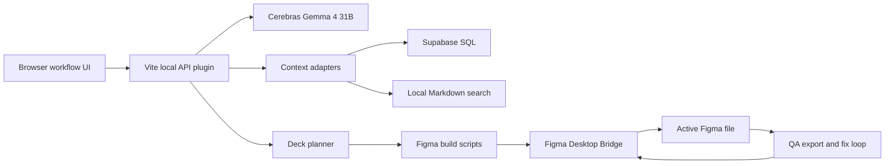

# Technical Architecture

## Overview

Gemma Deck Forge is a local-first React/Vite app with a local API layer, a Cerebras model client, optional context adapters, and a Figma Desktop Bridge transport.



## Runtime Surfaces

- `src/App.tsx`: staged UI, event logs, generated deck state, bridge status, and feedback flow.
- `src/server/apiPlugin.ts`: local HTTP API for context, generation, feedback, Figma generation, and Figma QA.
- `src/server/cerebras.ts`: Cerebras chat-completions wrapper with backup-key support and redacted errors.
- `src/server/contextSwarm.ts`: context workflows and retrieval adapters.
- `src/server/deck.ts`: deck generation, normalization, fallback content, and outline eval gates.
- `src/server/figmaBridge.ts`: local WebSocket server that forwards `EXECUTE_CODE` calls to the Figma plugin.
- `src/shared/figma.ts`: Figma generation and QA script builders.
- `bin/gemma-deck-forge.mjs`: public setup, doctor, and security scan CLI.

## API Flow

### Context

`POST /api/context/swarm/stream`

- Starts context lanes in parallel.
- Emits lane start, lane complete, lane error, workflow complete, and final context digest events.
- Uses fallback context when optional adapters are not configured.

### Generation

`POST /api/generate/stream`

- Runs agent prompts.
- Synthesizes a ten-slide deck.
- Normalizes every slide against the schema.
- Emits progress through Server-Sent Events.

### Figma Build

`POST /api/figma/build`

- Requires a valid deck.
- Builds deterministic Figma execution batches.
- Sends batches through the bridge in order.
- Stores the returned section id for later QA.
- Returns generation completeness and layout warnings.

### Figma QA

`POST /api/figma/qa`

- Requires the generated section id.
- Exports or captures slide evidence from the current section.
- Creates structured diagnosis and fix plans.
- Executes fixes against the same section.
- Repeats per-slide loops until pass or limit.
- Runs a final cleanup pass to remove temporary QA artifacts.

## Figma Bridge Contract

The bridge is a local WebSocket transport. The app sends one `EXECUTE_CODE` request at a time and waits for acknowledgement before sending the next mutation batch.

Rules:

- Model agents may run in parallel.
- Figma mutations are serialized.
- Generation and QA operate on a pinned section id.
- QA never creates a new deck unless the user starts generation again.
- Bridge timeouts and disconnections are user-visible errors.

## Visual QA Contract

The QA prompt should return structured data:

```json
{
  "status": "pass",
  "confidence": 0.94,
  "diagnosis": [],
  "fixes": [],
  "notesForNextLoop": "No further issues."
}
```

Failure output should be specific enough to convert into bridge code:

```json
{
  "status": "fail",
  "confidence": 0.72,
  "diagnosis": [
    "Headline overlaps the proof card on slide 3.",
    "Body text exceeds the safe area on slide 7."
  ],
  "fixes": [
    {
      "target": "slide-3 headline",
      "operation": "resize_and_reflow",
      "instruction": "Reduce font size, increase text box height, and move proof card down."
    }
  ],
  "notesForNextLoop": "Do not reapply fixes already executed in loop 1."
}
```

Each new loop must include the latest exported image plus the previous diagnoses and executed fixes.

## CLI Contract

The CLI exists so public users can validate setup quickly:

```bash
npm run install:guide
npm run setup:check
npm run security:scan
```

The CLI must not print secret values. It reports only pass, warn, or fail states.

## Performance and Robustness

The product should be fast because Cerebras calls are low-latency, but correctness gates are more important than fixed-duration choreography.

Required behavior:

- Avoid unbounded waits when optional context adapters fail.
- Surface partial context when a non-critical lane fails.
- Use deterministic fallback content when provider calls are unavailable.
- Do not mark Figma generation done until the bridge returns completion evidence.
- Do not mark QA done until each slide passes or reaches the loop limit with warnings.

## Verification Matrix

| Area | Command |
| --- | --- |
| Type safety | `npm run lint` |
| Unit/integration tests | `npm test` |
| Coverage | `npm run test:coverage` |
| Production build | `npm run build` |
| Public safety | `npm run security:scan` |
| Dependency audit | `npm audit --json` |
| Optional browser smoke | `npm run test:e2e` |
| Optional live model smoke | `npm run test:live` |

## Release Checklist

1. Run `npm run setup:check`.
2. Run `npm run security:scan`.
3. Run lint, tests, coverage, build, and audit.
4. Inspect `git diff --stat` and `git diff --check`.
5. Confirm README, AGENTS, and skills describe install and verification clearly.
6. Commit and push.
7. Make the GitHub repository public only after the checks pass.
